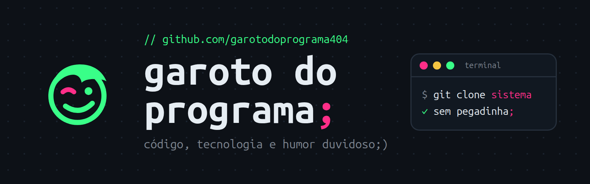

<p align="center">
  
</p>

```js
// sobre_o_garoto.js
const garoto = {
  canal: "Garoto do Programa;",
  faz: ["código", "tecnologia", "IA", "humor ácido"],
  sistemasGratis: true,   // sem pegadinha
  funcionaNaMinhaMaquina: true,
};
```

## sistemas grátis pra comunidade;

| sistema | pra quê |
|---|---|
| [**Audita Aí;**](https://github.com/garotodoprograma404/audita-ai) | confere você mesmo se a soma dos boletins de urna bate com o resultado oficial do TSE. Python puro, nada pra instalar |

*(tem mais vindo. segue o garoto pra não perder)*

## onde me achar;

[](https://instagram.com/garotodoprograma)
[](https://tiktok.com/@garotodoprograma)

<sub>// feito pelo Garoto do Programa; · código aberto, humor duvidoso;)</sub>
